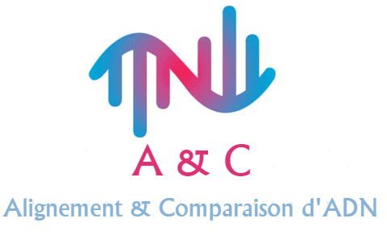
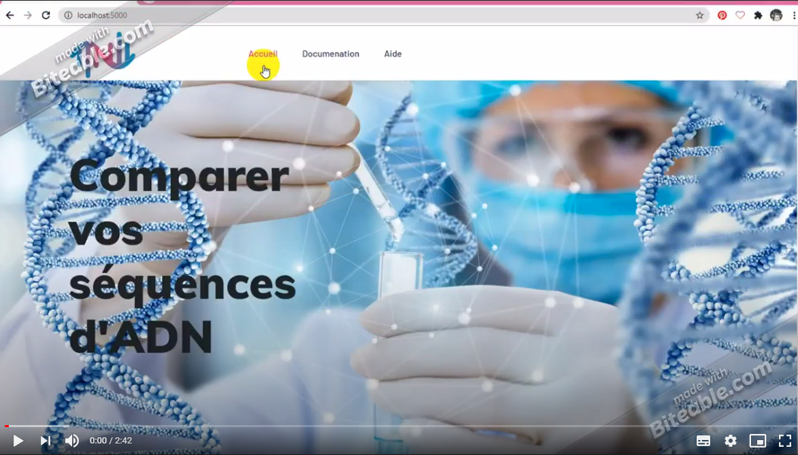

# A & C

##  
  La comparaison de séquences d’ADN est une pratique fondamentale pour de nombreuses applications de biologie et l’une des branches les plus importantes de la bio-informatique, puisque l’analyse et le traitement des données moléculaires s’effectue, " in silico ", au moyen de calculs complexes informatisés. 
  L’application A & C est développée dans le but de comparer les séquences d’ADN en utilisant une méthode de comparaison optimisée basée sur les k-mers et les structures d’index.
  L’application offre également aux biologistes la possibilité d’appliquer les résultats obtenus au domaine de la phylogénie.

#### Video demo
[](https://drive.google.com/file/d/15cHuQAKPvwgSF_W8bW1z_4dr2_3SDuQY/view?usp=sharing)
## Technologies
* Python
* Flask
* Bootstrap
* JavaScript
* HTML
* CSS
## Fonctionnalités
* Alignement des séquences par la méthode de Needlman Wunch
* Comparaison des séquences par des méthodes sans alignement
* Génération de l’arbre phylogénétique
* Lecture des séquences d’ADN (vérification du format et traitement des fichiers Fasta)
* Amélioration des performances par une recherche de similarité avec indexation
* Visualisation des bases nucléiques similaires
* Calcul des taux de similarités entre les paires de séquences
## Modules
* Biotie
* Bokeh
* Hashlib
* Itertools
* Math
* Numpy 
* Os 
* Werkzeug
## Installation
```
conda install -c anaconda biopython
conda install -c conda-forge/label/cf202003 biotite
conda install bokeh
pip install flask_table
```
```
git clone https://github.com/sirineFoudili/DNA-comparison-and-alignment-.git
```
[Présentation du prjet](https://drive.google.com/file/d/1wsgqZsdEcNtdtA9HEJBTqn2U-O8QK1bF/view?usp=sharing)
[Vidéo de présentation](https://drive.google.com/file/d/1cd4jTruTzgSD5K6m3uvq5hsDWQwFqF4T/view?usp=sharing)


